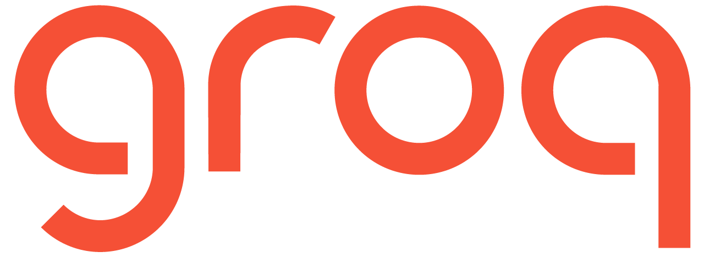
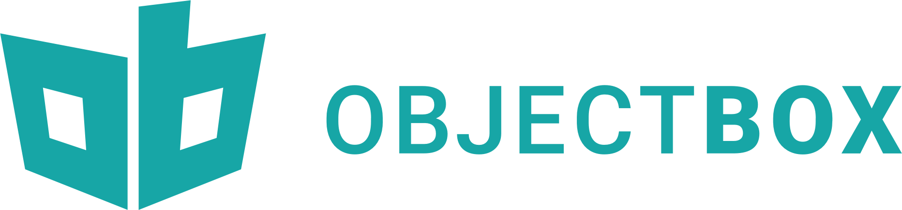
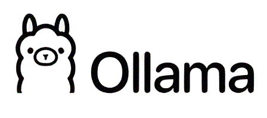

# LangChain Apps and Demos

A collection of small applications and notebooks demonstrating LangChain integrations with multiple model providers and vector stores. The repository includes:

- A FastAPI server exposing LangChain chains via LangServe.
- Streamlit apps for chat and RAG with OpenAI, Groq (Llama), Ollama (local models), FAISS, ObjectBox, and Google Generative AI embeddings.
- Example notebooks for agents, retrieval, RAG, and hybrid search.

This README describes the project structure, setup, environment configuration, and how to run each component.

## Technology stack

<table>
  <tr>
    <td align="center"></td>
    <td align="center"></td>
    <td align="center"></td>
  </tr>
  <tr>
    <td align="center"><b>LangChain</b> for orchestration</td>
    <td align="center"><b>Groq</b> for LLM inference</td>
    <td align="center"><b>Hugging Face</b> for models and embeddings</td>
  </tr>
  <tr>
    <td align="center"></td>
    <td align="center"></td>
    <td align="center"></td>
  </tr>
  <tr>
    <td align="center"><b>ObjectBox</b> as vector store</td>
    <td align="center"><b>Ollama</b> for local models</td>
    <td align="center"><b>DataStax</b> ecosystem</td>
  </tr>
</table>

## Project structure

```
.
├─ api/
│  ├─ app.py                 # FastAPI + LangServe routes (/openai, /essay, /poem)
│  └─ client.py              # Streamlit client that calls the API server
├─ chatbot/
│  ├─ open_api.py            # Streamlit: English→French with OpenAI Chat
│  └─ local_llama.py         # Streamlit: English→French with local Ollama (llama2)
├─ gemma/
│  └─ app.py                 # Streamlit: PDF RAG with Groq (Gemma-7b-it) + Google embeddings
├─ groq/
│  ├─ app.py                 # Streamlit: RAG over LangSmith docs, Groq Llama, Ollama embeddings
│  └─ llama3.py              # Streamlit: PDF RAG with Groq (Llama3) + OpenAI embeddings
├─ objectbox/
│  └─ app.py                 # Streamlit: RAG with ObjectBox vector store + Groq
├─ hybridsearch/
│  ├─ bm25_values.json       # Sample BM25 index parameters
│  └─ experiments.ipynb
├─ agents/agents.ipynb       # Notebook
├─ chain/retriever.ipynb     # Notebook
├─ huggingface/huggingface.ipynb
├─ rag/simplerag.ipynb
├─ requirements.txt
└─ README.md
```

## Requirements

- Python 3.10+ is recommended
- Windows, macOS, or Linux
- For local model demos: Ollama installed and the required models pulled (e.g., `llama2`, `mxbai-embed-large`)
- For specific apps, API keys as noted below

Install dependencies:

```
pip install -r requirements.txt
```

## Environment variables

Several apps rely on API keys loaded via `python-dotenv`. Create a `.env` file in the repository root with the keys you plan to use:

```
OPENAI_API_KEY=<your_openai_api_key>
LANGCHAIN_API_KEY=<your_langsmith_api_key_if_using_tracing>
LANGCHAIN_TRACING_V2=true

GROQ_API_KEY=<your_groq_api_key>              # Required for groq/ and gemma/
GOOGLE_API_KEY=<your_google_genai_api_key>    # Required for gemma/
```

Notes:
- The Ollama-based demos require the Ollama service running locally and the relevant models pulled, for example:
  - `ollama pull llama2`
  - `ollama pull mxbai-embed-large`
- Some apps expect a `./us_census/` directory containing PDF files for RAG examples. Create the directory and add PDFs before running those apps.

## Quick start (Windows PowerShell)

1) Create and activate a virtual environment

```
python -m venv .venv
.\.venv\Scripts\Activate.ps1
```

2) Install dependencies

```
pip install -r requirements.txt
```

3) Add a `.env` file (see Environment variables above)

## Running the applications

### 1. API server (FastAPI + LangServe)

Definition: `api/app.py`
- Routes:
  - `POST /openai/invoke` – raw ChatOpenAI chain
  - `POST /essay/invoke` – generates an essay (topic input)
  - `POST /poem/invoke` – generates a poem (topic input) via Ollama Llama2

Run the server (either method):

```
python api/app.py
```

or

```
uvicorn api.app:app --reload --host localhost --port 8000
```

Example request (PowerShell):

```
Invoke-WebRequest `
  -Uri http://localhost:8000/essay/invoke `
  -Method POST `
  -Body '{"input":{"topic":"LangChain"}}' `
  -ContentType 'application/json'
```

### 2. API Streamlit client

Definition: `api/client.py`

```
streamlit run api/client.py
```

- Enter a topic for “Write an essay on” (OpenAI-backed) or “Write a poem on” (Ollama-backed).

### 3. Chatbot – OpenAI

Definition: `chatbot/open_api.py`

- English to French translator using `ChatOpenAI`.

```
streamlit run chatbot/open_api.py
```

### 4. Chatbot – Local Llama (Ollama)

Definition: `chatbot/local_llama.py`

- English to French translator using `OllamaLLM` with `llama2`.
- Ensure Ollama is running and `llama2` is pulled.

```
streamlit run chatbot/local_llama.py
```

### 5. Groq – RAG over web docs

Definition: `groq/app.py`

- Loads content from LangSmith docs, builds a FAISS vector store with Ollama embeddings, and answers questions with a Groq Llama model.
- Requires `GROQ_API_KEY` and a running Ollama with `mxbai-embed-large`.

```
streamlit run groq/app.py
```

### 6. Groq – Llama3 PDF RAG

Definition: `groq/llama3.py`

- Builds a FAISS vector store from PDFs in `./us_census/` using OpenAI embeddings and answers with Groq Llama3.
- Requires `GROQ_API_KEY` and `OPENAI_API_KEY`.

```
streamlit run groq/llama3.py
```

### 7. Gemma – PDF RAG (Groq + Google embeddings)

Definition: `gemma/app.py`

- Uses `ChatGroq` with `Gemma-7b-it` and `GoogleGenerativeAIEmbeddings` for RAG over PDFs in `./us_census/`.
- Requires both `GROQ_API_KEY` and `GOOGLE_API_KEY`.

```
streamlit run gemma/app.py
```

### 8. ObjectBox – Vector store RAG

Definition: `objectbox/app.py`

- Uses ObjectBox as a vector store with `ChatGroq` for answering questions over PDFs in `./us_census/`.
- Requires `GROQ_API_KEY` and `OPENAI_API_KEY` for embeddings.
- Ensure the ObjectBox vector store package is installed and compatible on your platform.

```
streamlit run objectbox/app.py
```

## Notebooks

The repository includes several `.ipynb` notebooks under `agents/`, `chain/`, `huggingface/`, `rag/`, and `hybridsearch/`. Open them in Jupyter or VS Code to explore step-by-step examples.

## Troubleshooting

- Missing API keys: ensure your `.env` file includes the variables required for the app you are running, and that they are loaded before the app starts.
- Ollama errors: verify the service is running (`ollama serve`) and that required models are pulled.
- FAISS on Windows: ensure compatible versions and that your Python environment matches the wheels available on your platform.
- Port conflicts: the API server defaults to `localhost:8000`. If the port is in use, change it with `--port` when running `uvicorn`.
- Data folder: ensure `./us_census/` exists and contains PDFs before running the PDF RAG demos.
